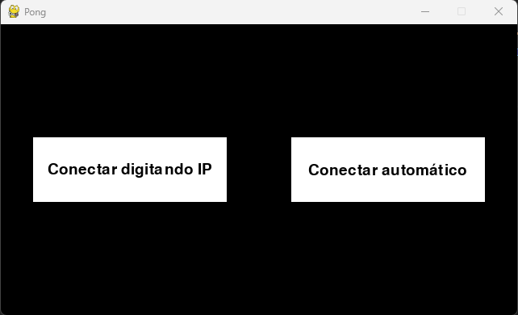
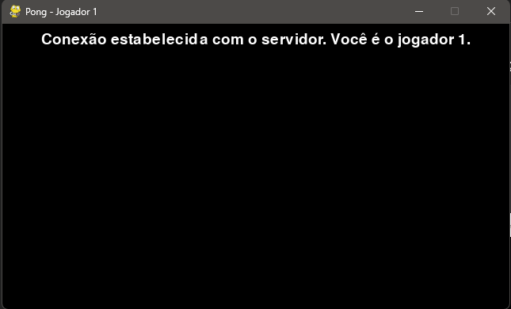
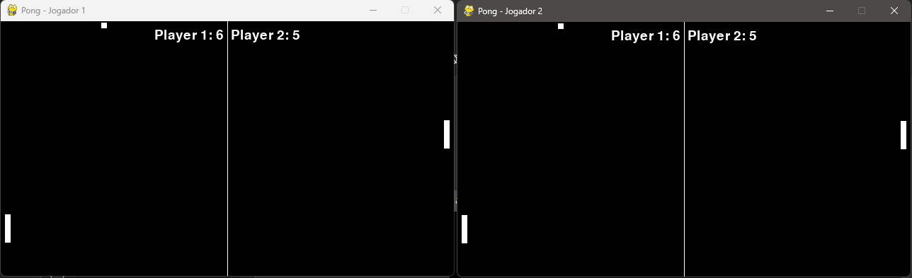
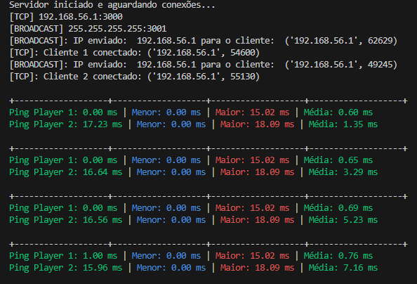

# Pong Multiplayer

Este projeto consiste em um jogo de Pong multiplayer simples em que dois jogadores podem pressionar teclas e enviar comandos um ao outro. O jogo é baseado em um servidor centralizado que gerencia as interações entre os jogadores.

## Objetivos

- Permitir a jogabilidade multiplayer em tempo real.
- Gerenciar as conexões e a troca de mensagens através de um servidor centralizado.
- Criar uma experiência de jogo simples e responsiva.

## Estrutura do Projeto

O projeto está organizado da seguinte forma:

- `server.py`: Responsável por gerenciar a conexão entre os jogadores e encaminhar comandos.
- `client.py`: Cliente que permite que os jogadores se conectem ao servidor e joguem Pong.

## Dependências

O projeto requer as seguintes dependências:

- Python 3.x
- Biblioteca `socket`
- Biblioteca `pickle`
- Biblioteca `threading`
- Biblioteca `time`
- Biblioteca `colorama`

Certifique-se de ter essas dependências instaladas em seu ambiente antes de executar o projeto.

## Executando o Projeto

Para executar o projeto, siga as etapas abaixo:

1. Certifique-se de ter o Python instalado em seu sistema.
2. Execute o arquivo `server.py` para iniciar o servidor.
3. Execute para cada jogador o arquivo `client.py`. Após isso, os jogadores podem se conectar usando o endereço IP exibido pelo servidor ou fazer uma conexão automática selecionando a opção correspondente.
4. Uma vez conectados, os jogadores podem pressionar as teclas para controlar suas raquetes no jogo.
5. O servidor gerenciará o envio dos comandos para o jogador oposto, permitindo a interação multiplayer.

## Funcionalidades

- **Multiplayer Online**: Permite que dois jogadores disputem uma partida através da rede.
- **Comandos em Tempo Real**: Transmissão de comandos praticamente instantânea entre os jogadores.
- **Servidor Centralizado**: Gerencia as comunicações e organiza a troca de informações.

## Imagens do Projeto

### Tela Inicial

### Conexão Estabelecida

### Partida em Andamento

### Mensagens de Sistema

## Guia de Comandos

### Comandos de Teclado

- **Seta para cima / para baixo**: Move a raquete do jogador para cima ou para baixo.
- **Opção de conexão automática**: Tenta encontrar e conectar ao servidor automaticamente.

### Eventos Especiais

- **Conexão / Desconexão**: Mensagens coloridas indicam quando jogadores entram ou saem do jogo.
- **Fim de Jogo**: O servidor informa o resultado e reseta a partida.

## Autor

Jorge Bruno Costa Alves

Universidade Federal do Ceará - Campus Quixadá.

## Créditos

O arquivo de som utilizado neste projeto foi criado por "michorvath" e está disponível para download em: [Link para o arquivo](https://freesound.org/people/michorvath/sounds/269718/)